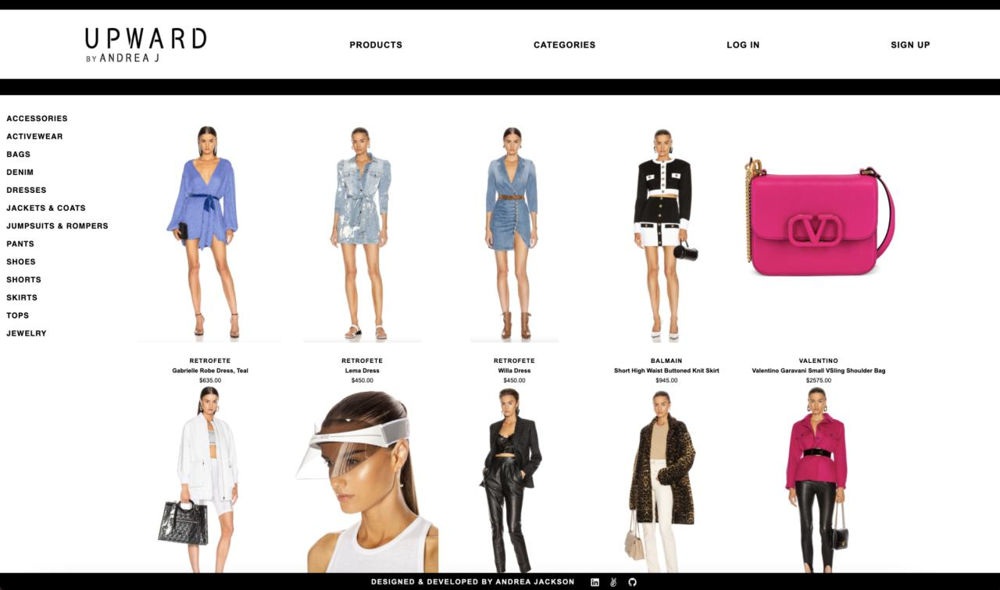

<p align="center">
  <a target="_blank" href="https://upward-fwrd-clone.herokuapp.com/">
    
  </a>
</p>

<br/>

# About The Project
This app is a clone of one of my favorite e-commerce sites, FWRD, which carries primarily women's clothing and accessories! You can browse different products and click on one for bigger image and more information on the product.

<br/>

## Built With
I used JavaScript and React / Redux for the frontend and Express for the backend.


<br />

* [React](https://reactjs.org/)
* [Express](https://expressjs.com/)
* [Node.jss](https://nodejs.org/en/)
* [PostgreSQL](https://www.postgresql.org/)

<br />

Deployed with:
* [](https://www.heroku.com/) [Heroku](https://www.heroku.com/)

<br />




<br/><br/><br/>

# Solo React Project


## Getting started

1. Clone this repository
2. Install dependencies (`npm install`)
3. Create a **.env** file based on the example with proper settings for your
   development environment
4. Setup your PostgreSQL user, password and database and make sure it matches your **.env** file with CREATEDB privileges

5. Run
   * `npm run db:create`
   * `npm run db:migrate`
   * `npm run db:seed:all`
   * `npm start`

## Deploy to Heroku

1. Create a new project
2. Under Resources click "Find more add-ons" and add the add on called "Heroku Postgres"
3. Install the [Heroku CLI](https://devcenter.heroku.com/articles/heroku-command-line)
4. Run `$ heroku login`
5. Add heroku as a remote to this git repo `$ heroku git:remote -a <project_name>`
6. Push the project to heroku `$ git push heroku master`
7. Connect to the heroku shell and prepare your database

```bash
    $ heroku run bash
    $ sequelize-cli db:migrate
    $ sequelize-cli db:seed:all
```
(You can interact with your database this way as youd like, but beware that `db:drop` should not be run in the heroku environment)

8. Add a `REACT_APP_BASE_URL` config var.  This should be the full URL of your react app: i.e. "https://solo-react.herokuapp.com"

9. profit


<br />

-----------------------

# Contact

GitHub Link: [https://github.com/aganesh0988/UPWARD](https://github.com/aganesh0988/UPWARD)

Live Link: [https://upward-fwrd-clone.herokuapp.com/](https://upward-fwrd-clone.herokuapp.com/)

Andrea Jackson - [@andrea-jackson1](https://www.linkedin.com/in/andrea-jackson1/) - andreajackson1109@gmail.com

Portfolio: [https://andreagjackson.com/](https://andreagjackson.com/)
